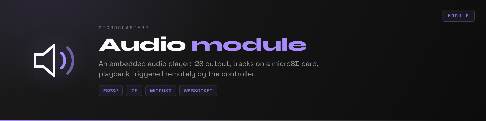
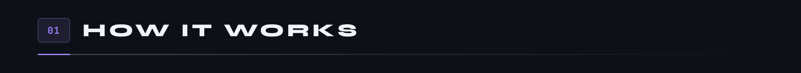
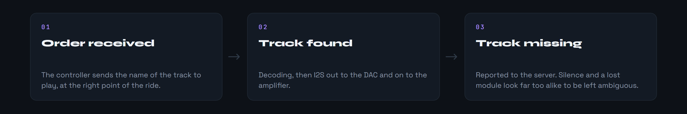
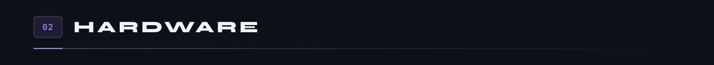
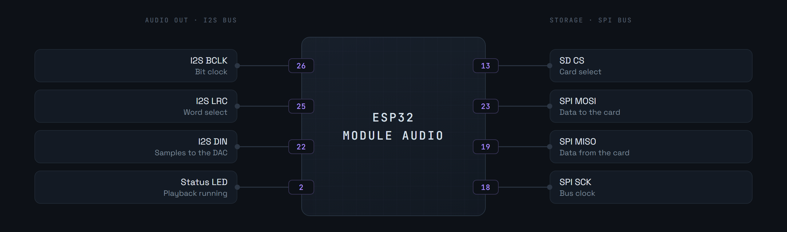
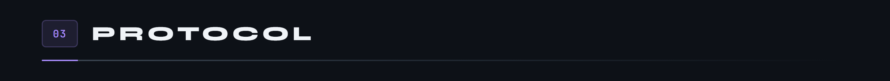

<div align="center">

<p>
  <a href="README.md"></a>
  
</p>



</div>

An audio playback module for MicroCoaster layouts. An ESP32 reads tracks stored on a microSD card and sends them out over I2S to an amplifier. Playback is triggered remotely by the controller, over WebSocket, to line the sound up with what is happening on the layout: a train leaving, a pass through the station, the sound effect of an element.

Like the other modules, it is configured on first boot through a captive portal, then joins the server.

**Version 0.0.0**



The module knows nothing about the layout. It receives a track name, finds it on the card, plays it. It is the controller that knows at what point of the ride a sound should fire.



The files go at the root of the microSD card.



Two buses share the board. I2S carries the sound to the DAC, SPI goes and fetches the files from the microSD card. Mixing them onto the same pins is the number one cause of choppy playback.



The I2S output stays digital all the way to the DAC, which avoids running a weak analogue signal alongside the power lines of the other modules.



The module authenticates on connection, then talks JSON, like every other module on the layout.

```json
{
  "type": "module_identify",
  "moduleId": "MC-0001-AU",
  "moduleType": "audio",
  "uptime": 12345
}
```

The controller sends the name of the track to play, and the module replies once playback has started, or reports that the file cannot be found.


First copy [`include/env.h.example`](include/env.h.example) to `include/env.h` and fill it in: fallback portal credentials, the module identity and its secret. That file is not in git, and without it the firmware does not compile.

Requires [PlatformIO](https://platformio.org/) inside Visual Studio Code.

```bash
pio run                  # build
pio run -t upload        # upload the firmware
pio run -t uploadfs      # upload the contents of data/ to LittleFS
pio device monitor       # serial console, 115200 baud
```

1. Power the module. It creates a WiFi access point.
2. Connect to it and open `http://192.168.4.1`.
3. Enter the target WiFi network.
4. The module reboots, joins the network and announces itself to the server.

The WiFi credentials stay in the module's memory, never in the repository.


```ini
links2004/WebSockets        ; link to the controller
bblanchon/ArduinoJson       ; the messages exchanged
esphome/ESP32-audioI2S      ; decoding and audio output
ayresnet/AyresWiFiManager   ; captive portal and reconnection
```

Module under development: playback and the WebSocket link work, what remains is remote volume control and queueing several tracks.

Embedded filesystem: **LittleFS**, which holds the portal pages. The common base for every module is the [WiFi Manager](https://github.com/Microcoaster/MicroCoaster_WifiManager/blob/main/README.en.md), and the driving is done from the [WebApp](https://github.com/Microcoaster/MicroCoasterWebApp/blob/main/README.en.md).

---

<sub>MicroCoaster · Author: Cybertrist</sub>
