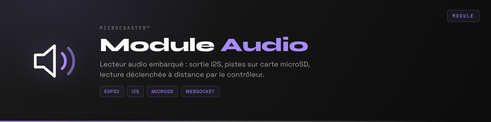
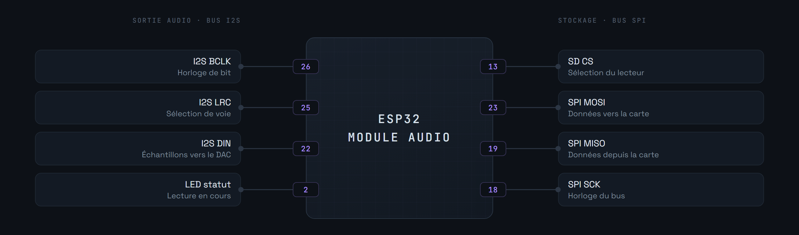

<div align="center">

<p>
  
  <a href="README.en.md"></a>
</p>



</div>

Module de lecture audio pour les circuits MicroCoaster. Un ESP32 lit des pistes stockées sur carte microSD et les sort en I2S vers un amplificateur. La lecture est déclenchée à distance par le contrôleur, en WebSocket, pour synchroniser le son avec ce qui se passe sur le circuit : départ de train, passage en station, effet sonore d'une figure.

Comme les autres modules, il se configure au premier démarrage par portail captif, puis rejoint le serveur.

**Version 0.0.0**


Le module ne connaît pas le circuit. Il reçoit un nom de piste, la cherche sur la carte, la joue. C'est le contrôleur qui sait à quel moment du parcours un son doit partir.


Les fichiers se placent à la racine de la carte microSD.


Deux bus cohabitent sur la carte. L'I2S porte le son vers le DAC, le SPI va chercher les fichiers sur la carte microSD. Les mélanger sur les mêmes broches est la première cause de lecture hachée.



La sortie I2S reste numérique jusqu'au DAC, ce qui évite de faire courir un signal analogique faible à côté des lignes de puissance des autres modules.


Le module s'authentifie à la connexion, puis échange en JSON, comme les autres modules du circuit.

```json
{
  "type": "module_identify",
  "moduleId": "MC-0001-AU",
  "moduleType": "audio",
  "uptime": 12345
}
```

Le contrôleur envoie le nom de la piste à jouer, le module répond une fois la lecture engagée, ou signale que le fichier est introuvable.


Copiez d'abord [`include/env.h.example`](include/env.h.example) en `include/env.h` et renseignez-le : identifiants du portail de secours, identité du module et son secret. Ce fichier n'est pas versionné, et sans lui le firmware ne compile pas.

Nécessite [PlatformIO](https://platformio.org/) dans Visual Studio Code.

```bash
pio run                  # compilation
pio run -t upload        # téléversement du firmware
pio run -t uploadfs      # téléversement du contenu de data/ vers LittleFS
pio device monitor       # console série, 115200 bauds
```

1. Alimenter le module. Il crée un point d'accès WiFi.
2. S'y connecter et ouvrir `http://192.168.4.1`.
3. Renseigner le réseau WiFi de destination.
4. Le module redémarre, rejoint le réseau et s'annonce auprès du serveur.

Les identifiants WiFi restent en mémoire du module, jamais dans le dépôt.


```ini
links2004/WebSockets        ; liaison avec le contrôleur
bblanchon/ArduinoJson       ; messages échangés
esphome/ESP32-audioI2S      ; décodage et sortie audio
ayresnet/AyresWiFiManager   ; portail captif et reconnexion
```

Module en développement : la lecture et la liaison WebSocket fonctionnent, restent à traiter le réglage de volume à distance et la mise en file d'attente de plusieurs pistes.

Système de fichiers embarqué : **LittleFS**, il héberge les pages du portail. Le socle commun à tous les modules est le [WiFi Manager](https://github.com/Microcoaster/MicroCoaster_WifiManager), et le pilotage se fait depuis la [WebApp](https://github.com/Microcoaster/MicroCoasterWebApp).

---

<sub>MicroCoaster · Auteur : Cybertrist</sub>
